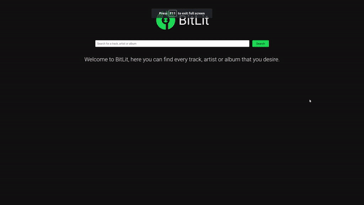
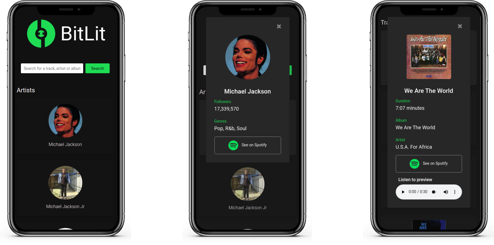

# 
 BitLit 

    

    

    

# About
BitLit is a music related searcher tha allows you to find artists, tracks and albums. Some of the tracks have a preview that you can listen in the application.

# Technologies

## JavaScript
JavaScript is responsible for the page's content display, ES6 and async functions were used.

## Spotify API
The Spotify API is responsible for the data of the application.

## Bootstrap 4
Bootstrap 4 is responsible for the grid and responsiveness of most of the page.

## CSS3
CSS3 is responsible for the styling of some of the elements present in the page.

## HTML5
HTML5 is responsible for the page structuring.

# How to use
First of all you'll have to clone this repository using the command `https://github.com/Eduardo-H/bitlit.git` 
This project uses the Spotify API, so you're going to need to have a Client ID and a Client Secret. You can have those accessing this link: https://developer.spotify.com/dashboard/applications. 
In case it's your first time using the Spotify API, it will asked you to create an account in the site, then you'll have to create an app and there you'll have access to your Client ID and Client Secret. Once you have both of them, you're gonna need to create a file named `credentials.js` in the folder `Models`, so the final path of the file has to be `js/Models/credentials.js`. Then you can enjoy the application.

# My experience
In this project I was able to reenforce the knowledgment gained in a web course of JavaScript, I've learned some new topics on my own during the development and I also learned how APIs works and how to use them.